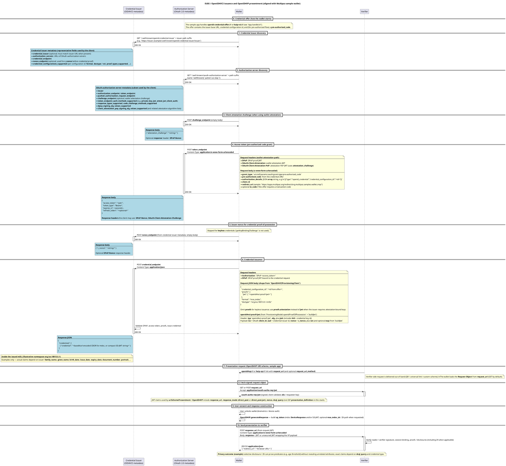
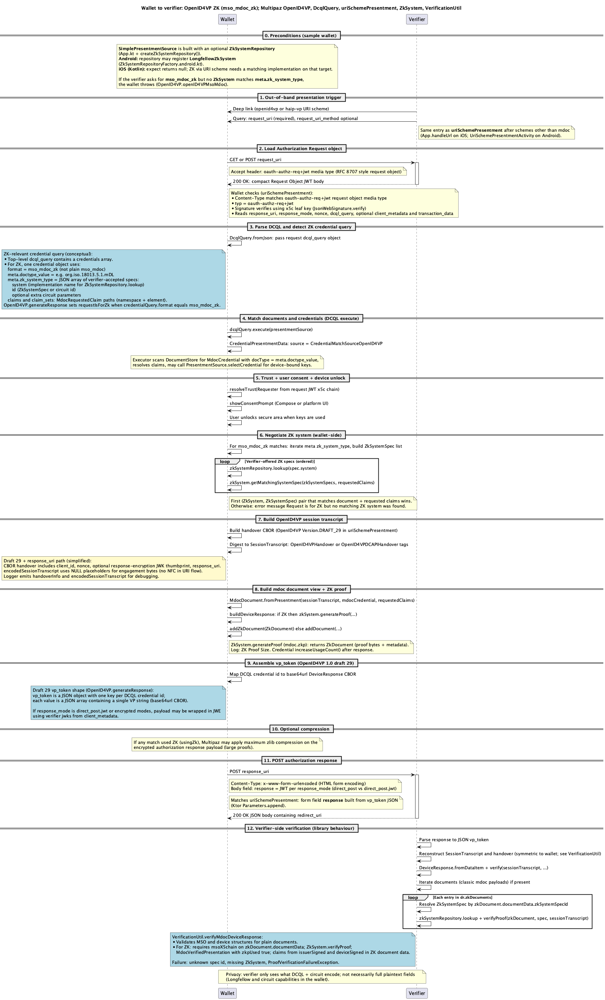

# meineWallet

Kotlin Multiplatform sample wallet based on [Multipaz](https://www.multipaz.org/). It demonstrates **OpenID4VCI** credential issuance, **OpenID4VP** presentation (including optional **ISO mdoc ZK** proofs on Android), NFC **mdoc** engagement, and platform integrations (Android Credential Manager, iOS Identity Document Provider).

This repository is used for thesis work; the implementation follows the Multipaz libraries (see `gradle/libs.versions.toml` for versions).

## Requirements

- **JDK 17** (Gradle uses JVM toolchain 17)
- **Android Studio** or Android SDK for the Android target (`minSdk` in version catalog)
- **Xcode** for iOS targets if you build the `iosApp` / Kotlin framework

## Project layout

| Path | Role |
|------|------|
| `composeApp/` | Shared Compose UI, OpenID4VCI provisioning, presentment wiring |
| `iosApp/` | iOS shell, SwiftUI, Identity Document Provider extension |
| `documentation/flows/` | PlantUML sequence sources (`.txt`) and rendered **PNG** diagrams |

## Build

From the repository root:

```bash
./gradlew :composeApp:assembleDebug          # Android debug APK
./gradlew :composeApp:compileKotlinIosArm64  # example iOS compilation
```

Use Android Studio **Run** for the `composeApp` configuration, or open `iosApp/iosApp.xcodeproj` for the iOS app.

## Protocol flows (PlantUML)

The diagrams below match the Multipaz client behaviour in this codebase (see `org.multipaz` dependencies). **PNG previews** render on GitHub; **full PlantUML** is in collapsible sections so you can copy into [PlantUML](https://www.plantuml.com/plantuml/) or a local JAR.

### Issuance (OpenID4VCI) and baseline presentation (OpenID4VP)

Canonical source: [`documentation/flows/issuance+verification.txt`](documentation/flows/issuance+verification.txt)


<details>
<summary>PlantUML source — issuance + verification</summary>



</details>

### Wallet → verifier with ZK (`mso_mdoc_zk`)

Canonical source: [`documentation/flows/wallet-verifier-zkp-openid4vp.txt`](documentation/flows/wallet-verifier-zkp-openid4vp.txt)

```plantuml
@startuml
title Wallet to verifier: OpenID4VP ZK (mso_mdoc_zk); Multipaz OpenID4VP, DcqlQuery, uriSchemePresentment, ZkSystem, VerificationUtil

participant Wallet
participant Verifier

== 0. Preconditions (sample wallet) ==
note over Wallet
**SimplePresentmentSource** is built with an optional **ZkSystemRepository**
(App.kt + createZkSystemRepository()).
**Android:** repository may register **LongfellowZkSystem**
(ZkSystemRepositoryFactory.android.kt).
**iOS (Kotlin):** expect returns null; ZK via URI scheme needs a matching implementation on that target.

If the verifier asks for **mso_mdoc_zk** but no **ZkSystem** matches **meta.zk_system_type**,
the wallet throws (OpenID4VP.openID4VPMsoMdoc).
end note

== 1. Out-of-band presentation trigger ==
Verifier -> Wallet: Deep link (openid4vp or haip-vp URI scheme)
Verifier -> Wallet: Query: request_uri (required), request_uri_method optional
note right of Verifier
Same entry as **uriSchemePresentment** after schemes other than mdoc
(App.handleUrl on iOS; UriSchemePresentmentActivity on Android).
end note

== 2. Load Authorization Request object ==
Wallet -> Verifier: GET or POST request_uri
note right of Wallet
Accept header: oauth-authz-req+jwt media type (RFC 8707 style request object)
end note
activate Verifier
Verifier --> Wallet: 200 OK: compact Request Object JWT body
deactivate Verifier

note right of Wallet
Wallet checks (uriSchemePresentment):
* Content-Type matches oauth-authz-req+jwt request object media type
* typ = oauth-authz-req+jwt
* Signature verifies using x5c leaf key (JsonWebSignature.verify)
* Reads response_uri, response_mode, nonce, dcql_query, optional client_metadata and transaction_data
end note

== 3. Parse DCQL and detect ZK credential query ==
Wallet -> Wallet: DcqlQuery.fromJson: pass request dcql_query object

note left of Wallet #ADD8E6
ZK-relevant credential query (conceptual):
* Top-level dcql_query contains a credentials array.
* For ZK, one credential object uses:
   format = mso_mdoc_zk (not plain mso_mdoc)
   meta.doctype_value = e.g. org.iso.18013.5.1.mDL
   meta.zk_system_type = JSON array of verifier-accepted specs:
      system (implementation name for ZkSystemRepository.lookup)
      id (ZkSystemSpec or circuit id)
      optional extra circuit parameters
   claims and claim_sets: MdocRequestedClaim paths (namespace + element).
OpenID4VP.generateResponse sets requestIsForZk when credentialQuery.format equals mso_mdoc_zk.
end note

== 4. Match documents and credentials (DCQL execute) ==
Wallet -> Wallet: dcqlQuery.execute(presentmentSource)
Wallet -> Wallet: CredentialPresentmentData: source = CredentialMatchSourceOpenID4VP

note over Wallet
Executor scans DocumentStore for MdocCredential with docType = meta.doctype_value,
resolves claims, may call PresentmentSource.selectCredential for device-bound keys.
end note

== 5. Trust + user consent + device unlock ==
Wallet -> Wallet: resolveTrust(Requester from request JWT x5c chain)
Wallet -> Wallet: showConsentPrompt (Compose or platform UI)
Wallet -> Wallet: User unlocks secure area when keys are used

== 6. Negotiate ZK system (wallet-side) ==
Wallet -> Wallet: For mso_mdoc_zk matches: iterate meta zk_system_type, build ZkSystemSpec list

loop Verifier-offered ZK specs (ordered)
  Wallet -> Wallet: zkSystemRepository.lookup(spec.system)
  Wallet -> Wallet: zkSystem.getMatchingSystemSpec(zkSystemSpecs, requestedClaims)
end

note right of Wallet
First (ZkSystem, ZkSystemSpec) pair that matches document + requested claims wins.
Otherwise: error message Request is for ZK but no matching ZK system was found.
end note

== 7. Build OpenID4VP session transcript ==
Wallet -> Wallet: Build handover CBOR (OpenID4VP Version.DRAFT_29 in uriSchemePresentment)
Wallet -> Wallet: Digest to SessionTranscript: OpenID4VPHandover or OpenID4VPDCAPIHandover tags

note left of Wallet #FFFACD
Draft 29 + response_uri path (simplified):
CBOR handover includes client_id, nonce, optional response-encryption JWK thumbprint, response_uri.
encodedSessionTranscript uses NULL placeholders for engagement bytes (no NFC in URI flow).
Logger emits handoverInfo and encodedSessionTranscript for debugging.
end note

== 8. Build mdoc document view + ZK proof ==
Wallet -> Wallet: MdocDocument.fromPresentment(sessionTranscript, mdocCredential, requestedClaims)
Wallet -> Wallet: buildDeviceResponse: if ZK then zkSystem.generateProof(...)
Wallet -> Wallet: addZkDocument(ZkDocument) else addDocument(...)

note right of Wallet
ZkSystem.generateProof (mdoc.zkp): returns ZkDocument (proof bytes + metadata).
Log: ZK Proof Size. Credential increaseUsageCount() after response.
end note

== 9. Assemble vp_token (OpenID4VP 1.0 draft 29) ==
Wallet -> Wallet: Map DCQL credential id to base64url DeviceResponse CBOR

note left of Wallet #ADD8E6
Draft 29 vp_token shape (OpenID4VP.generateResponse):
vp_token is a JSON object with one key per DCQL credential id;
each value is a JSON array containing a single VP string (base64url CBOR).

If response_mode is direct_post.jwt or encrypted modes, payload may be wrapped in JWE
using verifier jwks from client_metadata.
end note

== 10. Optional compression ==
note over Wallet
If any match used ZK (usingZk), Multipaz may apply maximum zlib compression on the
encrypted authorization response payload (large proofs).
end note

== 11. POST authorization response ==
Wallet -> Verifier: POST response_uri
note right of Wallet
Content-Type: x-www-form-urlencoded (HTML form encoding)
Body field: response = JWT per response_mode (direct_post vs direct_post.jwt)
end note
activate Verifier

note right of Wallet
Matches uriSchemePresentment: form field **response** built from vp_token JSON
(Ktor Parameters.append).
end note

Verifier --> Wallet: 200 OK JSON body containing redirect_uri
deactivate Verifier

== 12. Verifier-side verification (library behaviour) ==
Verifier -> Verifier: Parse response to JSON vp_token
Verifier -> Verifier: Reconstruct SessionTranscript and handover (symmetric to wallet; see VerificationUtil)

Verifier -> Verifier: DeviceResponse.fromDataItem + verify(sessionTranscript, ...)
Verifier -> Verifier: Iterate documents (classic mdoc payloads) if present

loop Each entry in dr.zkDocuments
  Verifier -> Verifier: Resolve ZkSystemSpec by zkDocument.documentData.zkSystemSpecId
  Verifier -> Verifier: zkSystemRepository.lookup + verifyProof(zkDocument, spec, sessionTranscript)
end

note left of Verifier #ADD8E6
VerificationUtil.verifyMdocDeviceResponse:
* Validates MSO and device structures for plain documents.
* For ZK: requires msoX5chain on zkDocument.documentData; ZkSystem.verifyProof;
   MdocVerifiedPresentation with zkpUsed true; claims from issuerSigned and deviceSigned in ZK document data.

Failure: unknown spec id, missing ZkSystem, ProofVerificationFailureException.
end note

note over Wallet, Verifier
Privacy: verifier only sees what DCQL + circuit encode; not necessarily full plaintext fields
(Longfellow and circuit capabilities in the wallet).
end note

@enduml


```



<details>
<summary>PlantUML source — wallet–verifier ZKP</summary>



</details>

## Regenerate diagram images

Install a PlantUML JAR (or use the [releases](https://github.com/plantuml/plantuml/releases)), then:

```bash
java -jar plantuml.jar -charset UTF-8 -tpng -o documentation/flows/images \
  documentation/flows/issuance+verification.txt \
  documentation/flows/wallet-verifier-zkp-openid4vp.txt
```

Committed PNGs live under `documentation/flows/images/`.

## License

See project and upstream Multipaz licensing as applicable.
