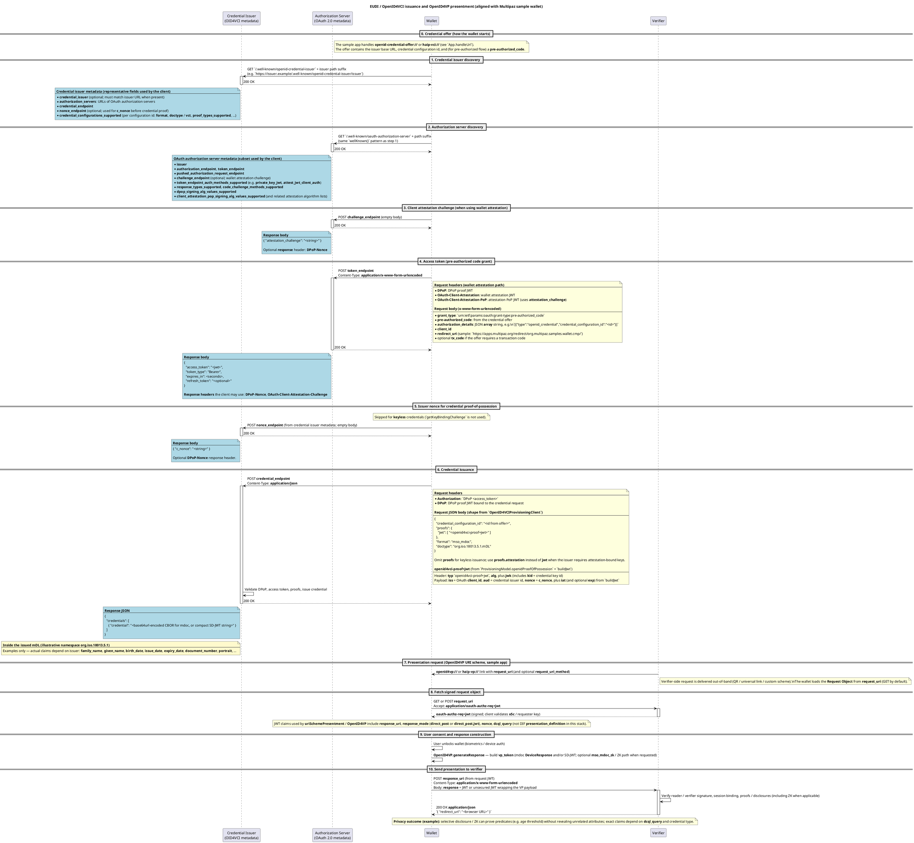

# meineWallet

**meineWallet** is a Kotlin Multiplatform (Android + iOS) digital identity wallet built on [Multipaz](https://www.multipaz.org/). It is the prototype artifact for a master's thesis on **privacy-preserving, ARF-aligned credential presentation using Zero-Knowledge Proofs (ZKPs)**.

It demonstrates an end-to-end EUDI-style flow:

- **OpenID4VCI** credential issuance (pre-authorized code grant)
- **OpenID4VP** presentation (DCQL, OpenID4VP draft 29)
- **ISO mdoc Zero-Knowledge proofs** via Google's **Longfellow** ZK system (`mso_mdoc_zk`) — Android only
- **NFC mdoc** proximity engagement (ISO/IEC 18013-5, HCE)
- **W3C Digital Credentials API** through Android Credential Manager and the iOS Identity Document Provider
- **RQ1 performance benchmarking** of ZKP operations, surfaced live in the app's Activity / Logs screens

> This is a research prototype, not a production wallet. Trust anchors are test/self-signed and the issuer/verifier are mock services on the Multipaz test infrastructure.

---

## Table of contents

1. [Tech stack](#tech-stack)
2. [Repository layout](#repository-layout)
3. [Prerequisites](#prerequisites)
4. [Quick start (Android)](#quick-start-android)
5. [Quick start (iOS)](#quick-start-ios)
6. [How to use the app](#how-to-use-the-app)
7. [Architecture overview](#architecture-overview)
8. [Zero-Knowledge proofs (Longfellow)](#zero-knowledge-proofs-longfellow)
9. [RQ1 benchmarking](#rq1-benchmarking)
10. [Configuration reference](#configuration-reference)
11. [Troubleshooting](#troubleshooting)
12. [Protocol flows (PlantUML)](#protocol-flows-plantuml)

---

## Tech stack

| Area | Choice | Version |
|------|--------|---------|
| Language | Kotlin (Multiplatform) | `2.3.10` |
| UI | Compose Multiplatform | `1.10.1` |
| Build | Gradle (wrapper) / AGP | `9.1.0` / `8.13.0` |
| JVM toolchain | JDK | `17` |
| Identity stack | Multipaz (`multipaz`, `-doctypes`, `-dcapi`, `-compose`, `-longfellow`) | `0.98.0` |
| Networking | Ktor client | `3.4.0` |
| Navigation | Navigation Compose | `2.9.2` |
| Images | Coil | `3.3.0` |
| Android SDK | `minSdk` / `target` / `compile` | `29` / `36` / `36` |
| iOS targets | `iosX64`, `iosArm64`, `iosSimulatorArm64` (static framework `meineWallet`) | — |

All versions are centralized in [`gradle/libs.versions.toml`](gradle/libs.versions.toml).

> **Note:** the Android Kotlin compiler runs with `allWarningsAsErrors = true` — any compiler warning fails the build.

---

## Repository layout

```
meineWallet/
├── composeApp/                       # Kotlin Multiplatform module (the app)
│   └── src/
│       ├── commonMain/               # Shared code (UI, navigation, provisioning, benchmarking)
│       │   ├── kotlin/.../cmp/
│       │   │   ├── App.kt            # Application singleton: storage, document store, trust, presentment
│       │   │   ├── Route.kt          # Type-safe navigation routes
│       │   │   ├── ProvisioningSupport.kt   # OpenID4VCI client backend + wallet attestation keys
│       │   │   ├── navhost/          # AppNavHost + WalletNavHost
│       │   │   ├── ui/               # Compose screens (Wallet, Document, Activity, Logs, ...)
│       │   │   ├── activity/         # Activity event + issuance history formatting
│       │   │   ├── benchmark/        # RQ1 ZKP instrumentation (proof time, memory, CPU, VP size)
│       │   │   └── logging/          # In-app log collector
│       │   ├── androidMain/          # Android entry points + Longfellow ZK factory
│       │   │   ├── .../MainActivity.kt
│       │   │   ├── .../CredentialManagerPresentmentActivity.kt
│       │   │   ├── .../UriSchemePresentmentActivity.kt
│       │   │   ├── .../NdefService.kt          # NFC HCE engagement
│       │   │   ├── .../ZkSystemRepositoryFactory.android.kt   # registers Longfellow
│       │   │   └── assets/longfellow-libzk-v1/ # ZK circuit files (Android)
│       │   ├── iosMain/              # iOS entry (MainViewController) + ZK factory (returns null)
│       │   └── commonTest/
│       └── build.gradle.kts          # KMP + Android app configuration
├── iosApp/                           # Xcode project (SwiftUI shell)
│   ├── iosApp/                       # ContentView.swift -> Compose MainViewController
│   ├── DocumentProviderExtension/    # iOS Identity Document Provider extension
│   └── Configuration/Config.xcconfig # TEAM_ID, bundle id, version
├── documentation/flows/              # PlantUML sources (.txt) + rendered PNG diagrams
├── gradle/libs.versions.toml         # Version catalog
└── settings.gradle.kts
```

---

## Prerequisites

| Tool | Required for | Notes |
|------|--------------|-------|
| **JDK 17** | All builds | Gradle uses JVM toolchain 17. Verify with `java -version`. |
| **Android Studio** (latest stable) | Android build/run | Bundled Android SDK; install platform **API 36** + build tools. |
| **Android device or emulator** | Running the app | Issuance works on an emulator. **ZKP presentation and NFC require a physical Android device** (Longfellow runs native code; NFC needs hardware). |
| **Xcode 15+** | iOS build/run | macOS only. Needed for the `iosApp` target / Kotlin framework. |
| **A network connection** | First build | Gradle downloads the Gradle 9.1.0 distribution and dependencies from Google Maven / Maven Central. |

You do **not** need to install Gradle manually — use the bundled `./gradlew` wrapper.

---

## Quick start (Android)

From the repository root:

```bash
# 1. Build a debug APK
./gradlew :composeApp:assembleDebug

# 2. Install onto a connected device / running emulator
./gradlew :composeApp:installDebug

# 3. (optional) build + install + launch in one step from Android Studio:
#    open the project, select the `composeApp` run configuration, press Run.
```

The debug APK is written to:

```
composeApp/build/outputs/apk/debug/composeApp-debug.apk
```

**Recommended:** open the project in **Android Studio**, let it sync Gradle, then Run on a physical device for the full ZKP + NFC experience.

---

## Quick start (iOS)

> macOS + Xcode required. ZKP presentation is **not** available on iOS in this prototype (`createZkSystemRepository()` returns `null`); issuance and standard presentation work.

1. Set your Apple developer **Team ID** in [`iosApp/Configuration/Config.xcconfig`](iosApp/Configuration/Config.xcconfig):

   ```
   TEAM_ID=YOURTEAMID
   ```

2. Open the Xcode project:

   ```bash
   open iosApp/iosApp.xcodeproj
   ```

3. Select the `iosApp` scheme and a simulator or device, then **Run**. Xcode invokes Gradle to build the shared `meineWallet` framework automatically.

To compile only the shared framework from the command line:

```bash
./gradlew :composeApp:compileKotlinIosArm64        # device arch
./gradlew :composeApp:compileKotlinIosSimulatorArm64
```

---

## How to use the app

1. **Add a credential (OpenID4VCI).** Obtain a credential offer (e.g. from [`issuer.multipaz.org`](https://issuer.multipaz.org)) as an `openid-credential-offer://` / `haip-vci://` link or QR. Opening it routes the app into the provisioning flow and stores the issued mDL.
2. **View / manage documents.** The wallet list shows stored credentials; tap one for details, claims, and removal.
3. **Present a credential (OpenID4VP).** Trigger an `openid4vp://` / `haip-vp://` request from a verifier (e.g. [`verifier.multipaz.org`](https://verifier.multipaz.org)). For a **ZK** request the verifier asks for `mso_mdoc_zk` and the wallet generates a Longfellow proof.
4. **NFC proximity.** Hold the device to a compatible mdoc reader to engage over NFC (HCE via `NdefService`).
5. **Activity & Logs.** The **Activity** screen lists presentation/issuance events; each ZKP presentation shows **RQ1 benchmark metrics**, and **View app logs** streams debug traces (`OpenID4VCI-HTTP`, `ZKP-Benchmark`).

---

## Architecture overview

- **`App`** (`App.kt`) is the application singleton. On `init()` it wires up: encrypted `Storage`, `SecureArea`, `DocumentStore`, the `DocumentTypeRepository` (mDL, PID, PhotoID, AgeVerification, …), a `TrustManager` seeded with test reader root CAs, the `SimplePresentmentSource` (with the optional `ZkSystemRepository`), and the `ProvisioningModel`.
- **Navigation** is two-tier and type-safe (`Route.kt`):
  - `AppNavHost` switches between **Wallet** and **Provisioning** based on `ProvisioningModel` state.
  - `WalletNavHost` covers the wallet list, document details/claims, the activity history, event/issuance detail, and app logs.
- **Platform entry points:**
  - **Android:** `MainActivity` (main UI + deep-link handling), `UriSchemePresentmentActivity` (OpenID4VP URI scheme), `CredentialManagerPresentmentActivity` (W3C DC API), `NdefService` (NFC HCE).
  - **iOS:** `ContentView.swift` hosts the Compose `MainViewController`; a `DocumentProviderExtension` integrates with the system.
- **`expect`/`actual`** boundaries (`AppPlatform`, `ZkSystemRepositoryFactory`, `benchmark/BenchmarkPlatform`) provide platform-specific storage, ZK availability, and resource sampling.

---

## Zero-Knowledge proofs (Longfellow)

- ZK is offered only when the verifier requests the `mso_mdoc_zk` format and advertises a matching `zk_system_type`.
- **Android** registers `LongfellowZkSystem` in `ZkSystemRepositoryFactory.android.kt`, loading circuit files from `composeApp/src/androidMain/assets/longfellow-libzk-v1/`.
- **iOS** returns `null` from `createZkSystemRepository()`, so ZK presentation is disabled on that platform in this prototype.
- The wallet selects the first `(ZkSystem, ZkSystemSpec)` pair that matches the document and requested claims, generates a `ZkDocument`, and embeds it in the `vp_token`. See the [ZK protocol flow](#wallet--verifier-with-zk-mso_mdoc_zk) below.

Verification happens on the verifier side (a Multipaz verifier such as `verifier.multipaz.org`, or a locally run `multipaz-verifier-server`), not in this wallet.

---

## RQ1 benchmarking

The wallet instruments ZKP **proof generation** on Android and surfaces the thesis RQ1 metrics in-app (Activity event detail, Activity list hint, and **View app logs**):

| Metric | Instrument | Where shown |
|--------|------------|-------------|
| Proof generation time | `SystemClock.elapsedRealtimeNanos()` | Activity detail, logs card, `ZKP-Benchmark` log |
| Peak memory usage (KB) | `Debug.MemoryInfo` (50 ms sampling) | Activity detail, logs card |
| CPU utilisation (%) | `/proc/self/stat` (50 ms sampling) | Activity detail, logs card |
| VP token payload size | `len(base64url.decode(vp_token))` | Activity detail, logs card |

Proof **verification** time is measured on the verifier server and is intentionally excluded from the wallet-side numbers. Instrumentation lives in `composeApp/src/commonMain/kotlin/org/multipaz/samples/wallet/cmp/benchmark/` (`InstrumentedZkSystem`, `ZkpBenchmarkStore`, `BenchmarkPlatform`).

---

## Configuration reference

| What | Value | Where |
|------|-------|-------|
| Android application id | `org.multipaz.samples.wallet.cmp` | `composeApp/build.gradle.kts` |
| App link server | `https://apps.multipaz.org` | `ProvisioningSupport.kt` + `AndroidManifest.xml` |
| Redirect path | `/redirect/org.multipaz.samples.wallet.cmp/` | `AndroidManifest.xml` (`autoVerify` app link) |
| OID4VCI offer schemes | `openid-credential-offer://`, `haip-vci://` | `AndroidManifest.xml`, `App.handleUrl` |
| OID4VP request schemes | `openid4vp://`, `haip-vp://` | `AndroidManifest.xml`, `UriSchemePresentmentActivity` |
| iOS bundle id / team | `Config.xcconfig` | set `TEAM_ID` before building |

App-link auto-verification requires a matching `.well-known/assetlinks.json` on the app-link server; without it, deep-link redirect handling for issuance may not auto-open the app. If you change the app-link domain, update **both** `ProvisioningSupport` and `AndroidManifest.xml`.

---

## Troubleshooting

| Symptom | Likely cause / fix |
|---------|--------------------|
| Gradle fails downloading `gradle-9.1.0-bin.zip` | First build needs network access to `services.gradle.org`. Retry online, or pre-seed the wrapper distribution. |
| Build fails on a compiler **warning** | `allWarningsAsErrors = true` — fix the warning (or suppress it as the codebase does for `expect/actual` beta warnings). |
| ZKP option never appears | ZK is Android-only and requires the verifier to request `mso_mdoc_zk`; ensure Longfellow circuits exist under `assets/longfellow-libzk-v1/`. |
| NFC engagement does nothing | Use a physical NFC-capable Android device; NFC is unavailable on emulators. |
| iOS build fails on signing | Set `TEAM_ID` in `Config.xcconfig` and select a valid signing team in Xcode. |
| Deep-link issuance doesn't auto-open | App-link verification needs `assetlinks.json` on the configured server. |

---

## Protocol flows (PlantUML)

The diagrams below match the Multipaz client behaviour in this codebase (see `org.multipaz` dependencies). **PNG previews** render on GitHub; **full PlantUML** is in collapsible sections so you can copy into [PlantUML](https://www.plantuml.com/plantuml/) or a local JAR.

### Issuance (OpenID4VCI) and baseline presentation (OpenID4VP)

Canonical source: [`documentation/flows/issuance+verification.txt`](documentation/flows/issuance+verification.txt)


<details>
<summary>PlantUML source — issuance + verification</summary>



</details>

### Wallet → verifier with ZK (`mso_mdoc_zk`)

Canonical source: [`documentation/flows/wallet-verifier-zkp-openid4vp.txt`](documentation/flows/wallet-verifier-zkp-openid4vp.txt)

```plantuml
@startuml
title Wallet to verifier: OpenID4VP ZK (mso_mdoc_zk); Multipaz OpenID4VP, DcqlQuery, uriSchemePresentment, ZkSystem, VerificationUtil

participant Wallet
participant Verifier

== 0. Preconditions (sample wallet) ==
note over Wallet
**SimplePresentmentSource** is built with an optional **ZkSystemRepository**
(App.kt + createZkSystemRepository()).
**Android:** repository may register **LongfellowZkSystem**
(ZkSystemRepositoryFactory.android.kt).
**iOS (Kotlin):** expect returns null; ZK via URI scheme needs a matching implementation on that target.

If the verifier asks for **mso_mdoc_zk** but no **ZkSystem** matches **meta.zk_system_type**,
the wallet throws (OpenID4VP.openID4VPMsoMdoc).
end note

== 1. Out-of-band presentation trigger ==
Verifier -> Wallet: Deep link (openid4vp or haip-vp URI scheme)
Verifier -> Wallet: Query: request_uri (required), request_uri_method optional
note right of Verifier
Same entry as **uriSchemePresentment** after schemes other than mdoc
(App.handleUrl on iOS; UriSchemePresentmentActivity on Android).
end note

== 2. Load Authorization Request object ==
Wallet -> Verifier: GET or POST request_uri
note right of Wallet
Accept header: oauth-authz-req+jwt media type (RFC 8707 style request object)
end note
activate Verifier
Verifier --> Wallet: 200 OK: compact Request Object JWT body
deactivate Verifier

note right of Wallet
Wallet checks (uriSchemePresentment):
* Content-Type matches oauth-authz-req+jwt request object media type
* typ = oauth-authz-req+jwt
* Signature verifies using x5c leaf key (JsonWebSignature.verify)
* Reads response_uri, response_mode, nonce, dcql_query, optional client_metadata and transaction_data
end note

== 3. Parse DCQL and detect ZK credential query ==
Wallet -> Wallet: DcqlQuery.fromJson: pass request dcql_query object

note left of Wallet #ADD8E6
ZK-relevant credential query (conceptual):
* Top-level dcql_query contains a credentials array.
* For ZK, one credential object uses:
   format = mso_mdoc_zk (not plain mso_mdoc)
   meta.doctype_value = e.g. org.iso.18013.5.1.mDL
   meta.zk_system_type = JSON array of verifier-accepted specs:
      system (implementation name for ZkSystemRepository.lookup)
      id (ZkSystemSpec or circuit id)
      optional extra circuit parameters
   claims and claim_sets: MdocRequestedClaim paths (namespace + element).
OpenID4VP.generateResponse sets requestIsForZk when credentialQuery.format equals mso_mdoc_zk.
end note

== 4. Match documents and credentials (DCQL execute) ==
Wallet -> Wallet: dcqlQuery.execute(presentmentSource)
Wallet -> Wallet: CredentialPresentmentData: source = CredentialMatchSourceOpenID4VP

note over Wallet
Executor scans DocumentStore for MdocCredential with docType = meta.doctype_value,
resolves claims, may call PresentmentSource.selectCredential for device-bound keys.
end note

== 5. Trust + user consent + device unlock ==
Wallet -> Wallet: resolveTrust(Requester from request JWT x5c chain)
Wallet -> Wallet: showConsentPrompt (Compose or platform UI)
Wallet -> Wallet: User unlocks secure area when keys are used

== 6. Negotiate ZK system (wallet-side) ==
Wallet -> Wallet: For mso_mdoc_zk matches: iterate meta zk_system_type, build ZkSystemSpec list

loop Verifier-offered ZK specs (ordered)
  Wallet -> Wallet: zkSystemRepository.lookup(spec.system)
  Wallet -> Wallet: zkSystem.getMatchingSystemSpec(zkSystemSpecs, requestedClaims)
end

note right of Wallet
First (ZkSystem, ZkSystemSpec) pair that matches document + requested claims wins.
Otherwise: error message Request is for ZK but no matching ZK system was found.
end note

== 7. Build OpenID4VP session transcript ==
Wallet -> Wallet: Build handover CBOR (OpenID4VP Version.DRAFT_29 in uriSchemePresentment)
Wallet -> Wallet: Digest to SessionTranscript: OpenID4VPHandover or OpenID4VPDCAPIHandover tags

note left of Wallet #FFFACD
Draft 29 + response_uri path (simplified):
CBOR handover includes client_id, nonce, optional response-encryption JWK thumbprint, response_uri.
encodedSessionTranscript uses NULL placeholders for engagement bytes (no NFC in URI flow).
Logger emits handoverInfo and encodedSessionTranscript for debugging.
end note

== 8. Build mdoc document view + ZK proof ==
Wallet -> Wallet: MdocDocument.fromPresentment(sessionTranscript, mdocCredential, requestedClaims)
Wallet -> Wallet: buildDeviceResponse: if ZK then zkSystem.generateProof(...)
Wallet -> Wallet: addZkDocument(ZkDocument) else addDocument(...)

note right of Wallet
ZkSystem.generateProof (mdoc.zkp): returns ZkDocument (proof bytes + metadata).
Log: ZK Proof Size. Credential increaseUsageCount() after response.
end note

== 9. Assemble vp_token (OpenID4VP 1.0 draft 29) ==
Wallet -> Wallet: Map DCQL credential id to base64url DeviceResponse CBOR

note left of Wallet #ADD8E6
Draft 29 vp_token shape (OpenID4VP.generateResponse):
vp_token is a JSON object with one key per DCQL credential id;
each value is a JSON array containing a single VP string (base64url CBOR).

If response_mode is direct_post.jwt or encrypted modes, payload may be wrapped in JWE
using verifier jwks from client_metadata.
end note

== 10. Optional compression ==
note over Wallet
If any match used ZK (usingZk), Multipaz may apply maximum zlib compression on the
encrypted authorization response payload (large proofs).
end note

== 11. POST authorization response ==
Wallet -> Verifier: POST response_uri
note right of Wallet
Content-Type: x-www-form-urlencoded (HTML form encoding)
Body field: response = JWT per response_mode (direct_post vs direct_post.jwt)
end note
activate Verifier

note right of Wallet
Matches uriSchemePresentment: form field **response** built from vp_token JSON
(Ktor Parameters.append).
end note

Verifier --> Wallet: 200 OK JSON body containing redirect_uri
deactivate Verifier

== 12. Verifier-side verification (library behaviour) ==
Verifier -> Verifier: Parse response to JSON vp_token
Verifier -> Verifier: Reconstruct SessionTranscript and handover (symmetric to wallet; see VerificationUtil)

Verifier -> Verifier: DeviceResponse.fromDataItem + verify(sessionTranscript, ...)
Verifier -> Verifier: Iterate documents (classic mdoc payloads) if present

loop Each entry in dr.zkDocuments
  Verifier -> Verifier: Resolve ZkSystemSpec by zkDocument.documentData.zkSystemSpecId
  Verifier -> Verifier: zkSystemRepository.lookup + verifyProof(zkDocument, spec, sessionTranscript)
end

note left of Verifier #ADD8E6
VerificationUtil.verifyMdocDeviceResponse:
* Validates MSO and device structures for plain documents.
* For ZK: requires msoX5chain on zkDocument.documentData; ZkSystem.verifyProof;
   MdocVerifiedPresentation with zkpUsed true; claims from issuerSigned and deviceSigned in ZK document data.

Failure: unknown spec id, missing ZkSystem, ProofVerificationFailureException.
end note

note over Wallet, Verifier
Privacy: verifier only sees what DCQL + circuit encode; not necessarily full plaintext fields
(Longfellow and circuit capabilities in the wallet).
end note

@enduml


```


<details>
<summary>PlantUML source — wallet–verifier ZKP</summary>



</details>

## Regenerate diagram images

Install a PlantUML JAR (or use the [releases](https://github.com/plantuml/plantuml/releases)), then:

```bash
java -jar plantuml.jar -charset UTF-8 -tpng -o documentation/flows/images \
  documentation/flows/issuance+verification.txt \
  documentation/flows/wallet-verifier-zkp-openid4vp.txt
```

Committed PNGs live under `documentation/flows/images/`.

## License

This repository is a master's thesis research artifact. It builds on the [Multipaz](https://www.multipaz.org/) libraries — see upstream Multipaz licensing for the dependencies. Apply your institution's/repository's licensing terms to the original code in this project as applicable.
